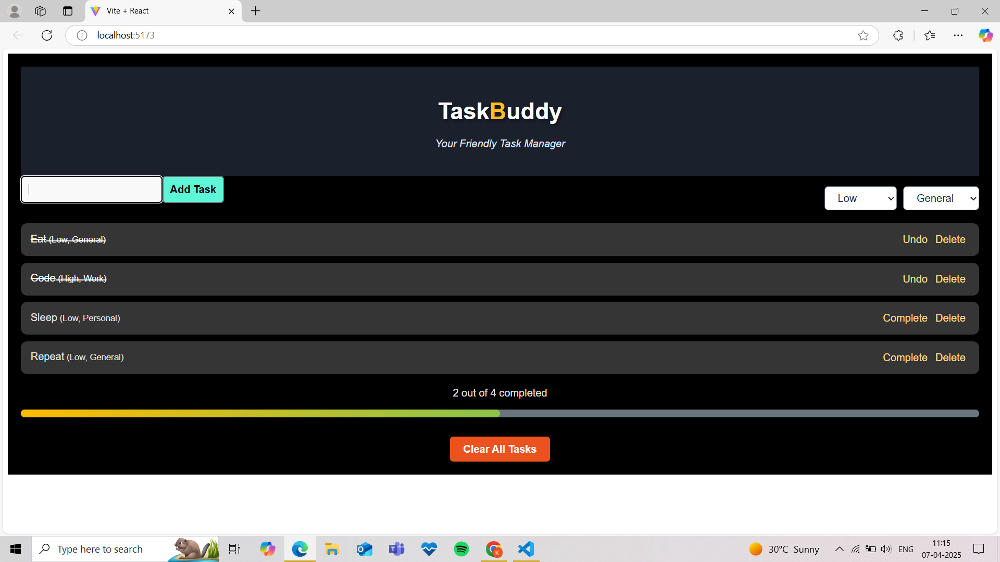

# 🚀 TaskBuddy

TaskBuddy is a powerful task management app built using **ReactJS**.  
It helps users manage daily tasks with ease — add, update, delete, track progress, and clear all tasks with just one click!

---

## 📸 Preview

---

## ✨ Features

- ✅ **Add Tasks**: Users can add new tasks to the list.  
- 📝 **Update Tasks**: Users can edit the details of existing tasks.  
- ❌ **Delete Tasks**: Users can remove tasks from the list.  
- 🧹 **Clear All Tasks**: Users can clear all tasks with a single click.  
- 📊 **Progress Tracker**: Visual representation of the task completion status.

---

## 🛠️ Usage

- ➕ **Adding Tasks**: Enter task details and click "Add Task".
- ✏️ **Updating Tasks**: Click on a task to edit its details.
- 🗑️ **Deleting Tasks**: Click the trash icon next to a task.
- 🚮 **Clearing All Tasks**: Click the "Clear All Tasks" button.
- 📈 **Progress Tracker**: View the task progress in the tracker.

---

